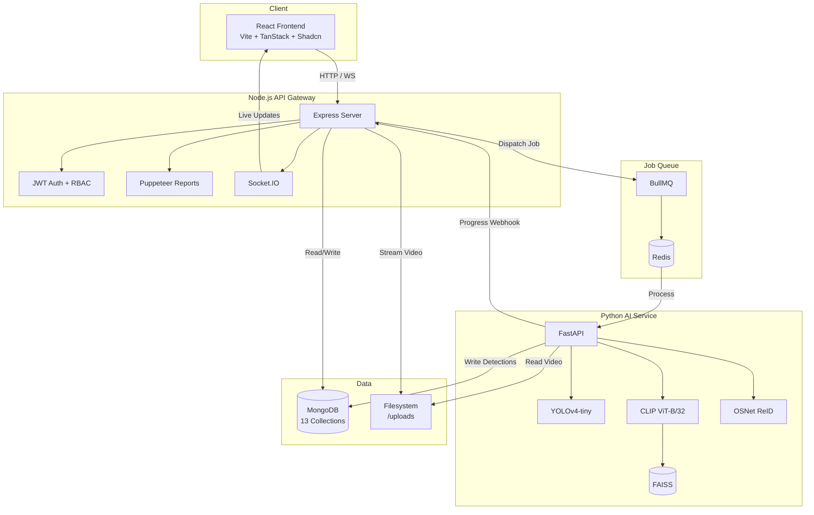

<p align="center">
  <h1 align="center">EYEQ</h1>
  <p align="center">
    <strong>Enterprise-Grade Video Investigation & AI-Powered Person Re-Identification Platform</strong>
  </p>
  <p align="center">
    
    
    
    
    
    
  </p>
  <p align="center">
    
    
    
    
  </p>
</p>

---

EYEQ is a highly scalable, distributed AI intelligence platform designed to transform raw CCTV footage into searchable, actionable forensic data. By unifying computer vision object detection, zero-shot semantic video search, and cross-camera person tracking, EYEQ bridges the critical gap between passive video storage and active investigation workflows.

---

## Core Capabilities

- **Intelligent Video Ingestion:** Upload footage to automatically extract frames and generate baseline analytical metadata.
- **Semantic Zero-Shot Search:** Leverage CLIP embeddings to search through video history using natural language (e.g., *"person carrying a red backpack"*), bypassing traditional rigid categorization.
- **Cross-Camera Subject Tracking (ReID):** Utilize OSNet embeddings to securely generate appearance signatures, allowing investigators to track specific individuals seamlessly across multiple, disparate video sources.
- **Forensic Case Management:** Curate evidence boards, annotate chronological investigation timelines, and automatically generate professional PDF reports using headless Puppeteer engines.
- **Real-Time Pipeline Observability:** Monitor the progress of asynchronous BullMQ processing queues via Socket.IO real-time WebSocket integrations.

---

## System Architecture

EYEQ is built on a containerized, decoupled microservices architecture designed for high availability and extensive scaling.

<details>
<summary><strong>View Architecture Diagram</strong></summary>


</details>

### Tech Stack
- **Frontend:** React 19, Vite, TanStack Router, TailwindCSS, Framer Motion
- **API Gateway:** Node.js, Express, Mongoose, JWT, Socket.IO, BullMQ
- **AI Inference Service:** Python, FastAPI, PyTorch, FAISS
- **Data & Queue Layer:** MongoDB 6.0, Redis 7

---

## AI Pipeline Mechanics

<details>
<summary><strong>View Deep-Dive AI Pipeline Details</strong></summary>

1. **Extraction:** Videos are processed at 1 FPS via OpenCV to maximize semantic context while minimizing computational load.
2. **Detection:** YOLOv4-tiny identifies and localizes subjects and objects of interest instantly.
3. **Semantic Encoding:** Detected objects are cropped and passed through OpenAI's CLIP (ViT-B/32), mapping visual data to a 512D text-image shared latent space.
4. **Re-Identification:** Person detections are specifically routed through OSNet, extracting high-fidelity discriminative features for identity matching.
5. **Vector Indexing:** 512D embeddings are indexed in FAISS for sub-millisecond Approximate Nearest Neighbor (ANN) retrieval.
</details>

---

## Quick Start

### Docker Compose (Recommended)
The easiest way to boot the entire microservice architecture is via Docker Compose:

```bash
git clone https://github.com/Dheeraj-1111-hub/eyeq-video-intelligence.git
cd eyeq-video-intelligence
docker compose up --build
```

| Service        | URL                        |
|---------------|----------------------------|
| Frontend       | http://localhost:8080       |
| Backend API    | http://localhost:5000       |
| AI Service API | http://localhost:8001/docs  |

### Manual Environment Setup

If running locally without Docker, ensure you have **Node.js 20+**, **Python 3.10+**, and a running **MongoDB** instance.

**1. AI Service**
```bash
cd ai-service
python -m venv venv && source venv/bin/activate  # Windows: venv\Scripts\activate
pip install -r requirements.txt
python -m uvicorn main:app --port 8001 --reload
```

**2. Node.js Backend API**
```bash
cd backend
npm install
# Ensure you configure your .env file with MONGODB_URI and JWT_SECRET
npm run dev
```

**3. React Frontend**
```bash
cd frontend
npm install
npm run dev
```

---

## Security & Operations

- **Authentication:** Custom JWT authentication with bcrypt password hashing.
- **RBAC:** Strict Role-Based Access Control enforcing `Investigator`, `Supervisor`, and `Admin` tiers.
- **Auditing:** Tamper-evident logging of all systemic configurations and case alterations.
- **Configuration:** All AI thresholds (YOLO confidence, ReID similarity, semantic relevance) are completely user-configurable via the backend database, ensuring EYEQ is a tunable platform, not a black box.


