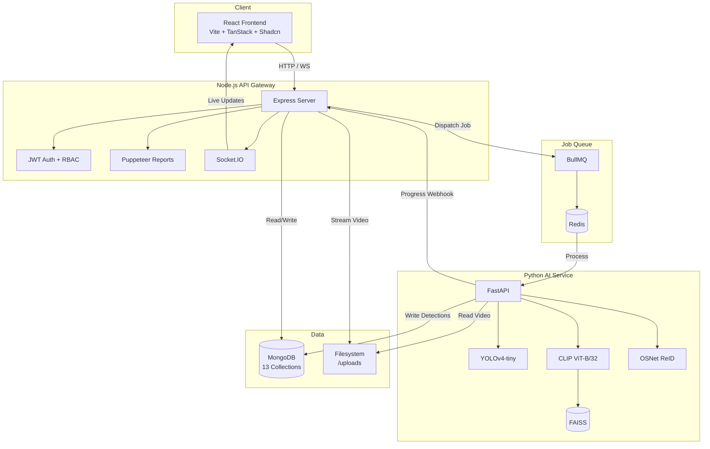
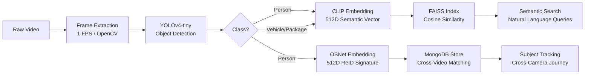
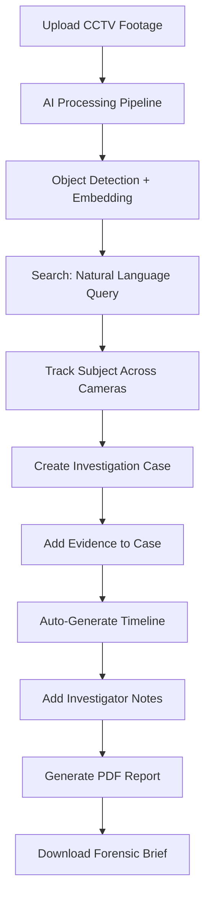

<p align="center">
  <h1 align="center">EYEQ</h1>
  <p align="center">
    <strong>AI-Powered Video Investigation & Person Re-Identification Platform</strong>
  </p>
  <p align="center">
    
    
    
    
    
    
    
    
    
  </p>
</p>

---

EYEQ is a distributed AI platform that transforms raw CCTV footage into actionable intelligence. It bridges the gap between passive video storage and active investigation — enabling natural language video search, automated object detection, cross-camera person tracking, and full-cycle case management with professional report generation.

---

## Problem

Security teams and investigators drown in hours of raw footage. Manual review is slow, error-prone, and doesn't scale. Existing tools either detect objects without context, or manage cases without AI — never both.

## Solution

EYEQ unifies the entire investigation workflow into a single platform:

1. **Upload footage** → AI automatically detects persons, vehicles, and packages
2. **Search in natural language** → "person carrying a backpack" finds matching detections via semantic vector similarity
3. **Track subjects across cameras** → Re-identification matches the same person across multiple videos using appearance embeddings
4. **Build investigation cases** → Add evidence, annotate timelines, generate professional PDF reports

---

## Architecture



---

## AI Pipeline



**Key Design Decision:** All AI thresholds (YOLO confidence, ReID similarity, search relevance) are **user-configurable** via the Settings page. The backend reads `UserSettings` from MongoDB and passes them directly to the Python inference engine — making EYEQ a tunable system, not a black box.

---

## Tech Stack

| Layer         | Technology                                                          |
|--------------|----------------------------------------------------------------------|
| **Frontend** | React 19, Vite, TanStack Router, TanStack Query, Shadcn UI, Tailwind |
| **Backend**  | Node.js, Express, Mongoose, Multer, fluent-ffmpeg, Puppeteer, JWT    |
| **AI Service** | Python, FastAPI, PyTorch, OpenCV, CLIP (ViT-B/32), OSNet, FAISS    |
| **Database** | MongoDB 6.0, FAISS (in-memory vector store)                         |
| **Queue**    | BullMQ, Redis 7                                                      |
| **Real-time**| Socket.IO                                                            |
| **Infra**    | Docker Compose, GitHub Actions CI/CD                                 |

---

## Key Features

### Video Intelligence
*(User: Add a screenshot of the Workspace showing bounding boxes and the summary panel here)*
``

- **Video Ingestion** — Multer upload, FFprobe metadata extraction (duration, FPS, resolution)
- **HTTP 206 Streaming** — Range-based video delivery for instant playback
- **AI Detection Overlay** — Real-time bounding box rendering on the video player
- **Detection Summary** — Aggregated counts for persons, vehicles, packages + peak activity window

### Semantic Search
*(User: Add a screenshot of the Search page showing natural language query and vector results here)*
``

- **Natural Language Queries** — Type "red car in parking lot" to find matching detections
- **CLIP Vector Similarity** — Text and images mapped to shared 512D vector space
- **FAISS Retrieval** — Sub-millisecond approximate nearest-neighbor search
- **Configurable Threshold** — User-adjustable relevance cutoff

### Person Re-Identification
*(User: Add a screenshot of the Subject Journey or ReID panel here)*
``

- **OSNet Embeddings** — 512D appearance signatures per person detection
- **Cross-Video Tracking** — Find the same person across multiple cameras
- **Subject Journey** — Chronological timeline of a subject's movements
- **Subject Profiles** — Persistent identity records with averaged embeddings

### Investigation Cases
*(User: Add a screenshot of the Case Details timeline or PDF report preview here)*
``

- **Case Management** — Create, prioritize, and track investigation cases
- **Evidence Collection** — Add detected objects as case evidence with one click
- **Timeline Generation** — Automatic chronological reconstruction from evidence
- **Investigator Notes** — Free-text annotations with user attribution
- **PDF Reports** — Professional forensic briefs generated via Puppeteer (headless Chrome)

### Platform Operations
*(User: Add a screenshot of the Analytics Dashboard or Administration panel here)*
``

- **JWT Authentication** — Custom auth with bcrypt password hashing
- **Role-Based Access Control** — Investigator, Supervisor, Admin roles
- **BullMQ Job Queue** — Redis-backed async video processing with concurrency control
- **Real-Time Progress** — Socket.IO broadcasting during AI pipeline execution
- **Analytics Dashboard** — Processing metrics, search history, case distribution
- **User Settings** — Configurable AI thresholds, notification preferences, retention policies
- **Notifications** — Event-driven alerts (processing complete, case updates, report ready)
- **Administration** — System-wide metrics, storage stats, audit logs
- **Audit Logging** — Tamper-evident record of all user actions

---

## Investigation Flow



---

## Quick Start

### Docker (Recommended)

```bash
git clone https://github.com/your-username/Video-Intelligence.git
cd Video-Intelligence
docker compose up --build
```

| Service        | URL                        |
|---------------|----------------------------|
| Frontend       | http://localhost:8080       |
| Backend API    | http://localhost:5000       |
| AI Service     | http://localhost:8001/docs  |

### Manual Setup

**Prerequisites:** Node.js 18+, Python 3.10+, MongoDB

```bash
# 1. AI Service
cd ai-service
python -m venv venv && venv\Scripts\activate
pip install -r requirements.txt
python -m uvicorn main:app --port 8001 --reload

# 2. Backend (new terminal)
cd backend
npm install
# Create .env with MONGODB_URI, JWT_SECRET, AI_SERVICE_URL
npm run dev

# 3. Frontend (new terminal)
cd frontend
npm install
npm run dev
```

---

## Environment Variables

### Backend (`backend/.env`)

| Variable         | Required | Default                    | Description                   |
|-----------------|----------|----------------------------|-------------------------------|
| `MONGODB_URI`   | Yes      | —                          | MongoDB connection string     |
| `JWT_SECRET`    | Yes      | —                          | JWT signing secret            |
| `AI_SERVICE_URL`| No       | `http://localhost:8001`    | Python AI service URL         |
| `REDIS_URL`     | No       | —                          | Enables BullMQ job queue      |
| `PORT`          | No       | `5000`                     | Express server port           |

### AI Service (`ai-service/.env`)

| Variable         | Required | Default                    | Description                   |
|-----------------|----------|----------------------------|-------------------------------|
| `MONGODB_URI`   | Yes      | —                          | MongoDB connection string     |
| `BACKEND_URL`   | No       | `http://backend:5000`      | Progress webhook target       |

---

## Project Structure

```
Video-Intelligence/
├── frontend/                    # React + Vite + TanStack
│   ├── src/
│   │   ├── routes/              # File-based routing (7 pages)
│   │   ├── components/          # Shadcn UI + custom components
│   │   ├── contexts/            # AuthContext (JWT state)
│   │   ├── services/            # API clients (axios)
│   │   └── hooks/               # Custom React hooks
│   └── Dockerfile
│
├── backend/                     # Node.js + Express
│   ├── src/
│   │   ├── controllers/         # 9 route handlers
│   │   ├── models/              # 13 Mongoose schemas
│   │   ├── routes/              # 9 route definitions
│   │   ├── middleware/          # Auth, RBAC, Upload
│   │   ├── services/            # ReID, Reports, Summaries
│   │   ├── queue/               # BullMQ video worker
│   │   └── server.ts            # Express entry point
│   └── Dockerfile
│
├── ai-service/                  # Python + FastAPI
│   ├── app/
│   │   ├── detectors/           # YOLOv4-tiny (OpenCV DNN)
│   │   ├── embeddings/          # CLIP encoder
│   │   ├── reid/                # OSNet person re-identification
│   │   ├── search/              # FAISS vector database
│   │   ├── services/            # Detection pipeline orchestrator
│   │   └── routes/              # FastAPI endpoints
│   ├── main.py                  # FastAPI entry point
│   └── Dockerfile
│
├── docs/                        # Architecture documentation
│   ├── Architecture.md
│   ├── AI-Pipeline.md
│   ├── DatabaseSchema.md
│   ├── SystemDesign.md
│   ├── Deployment.md
│   ├── API-Reference.md
│   └── DemoScript.md
│
├── docker-compose.yml           # Full stack orchestration
└── README.md
```

---

## Documentation

| Document | Description |
|----------|-------------|
| [Architecture](docs/Architecture.md) | System topology, inter-service communication, data flow |
| [AI Pipeline](docs/AI-Pipeline.md) | YOLO → CLIP → FAISS → OSNet → ReID pipeline details |
| [Database Schema](docs/DatabaseSchema.md) | All 13 MongoDB models with ER diagram |
| [System Design](docs/SystemDesign.md) | Architectural decisions and engineering tradeoffs |
| [Deployment](docs/Deployment.md) | Docker, manual setup, cloud deployment guide |
| [API Reference](docs/API-Reference.md) | Complete REST API documentation (40+ endpoints) |
| [Demo Script](docs/DemoScript.md) | Repeatable 3–5 minute demo walkthrough |

---

## Resume Entry

> **EYEQ — AI-Powered Investigation & Video Intelligence Platform**
>
> • Built a distributed AI platform using React, Node.js, FastAPI, MongoDB, Redis, BullMQ, and Docker.
>
> • Designed a computer vision pipeline using YOLO for object detection, CLIP embeddings for semantic video search, and ReID embeddings for cross-camera person tracking.
>
> • Implemented natural language CCTV search, vector similarity retrieval, evidence management, investigation timelines, and automated PDF report generation.
>
> • Developed cross-video subject tracking with confidence-based matching and subject journey visualization.
>
> • Engineered a production-ready architecture featuring job queues, real-time processing updates, audit logging, role-based access control, monitoring, notifications, and containerized deployment.

---

## License

Distributed under the MIT License.
