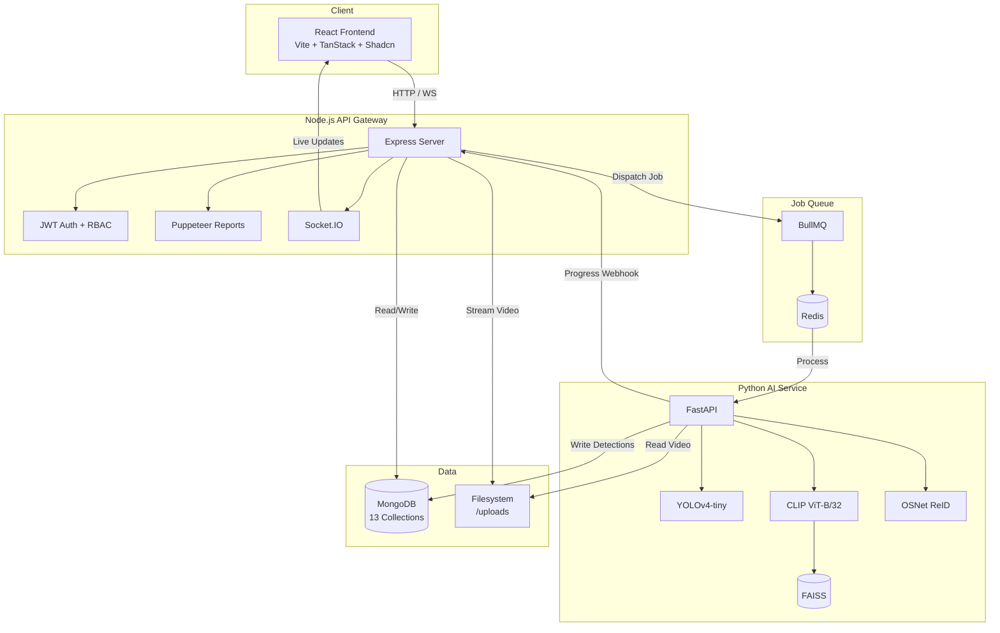
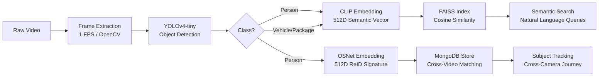
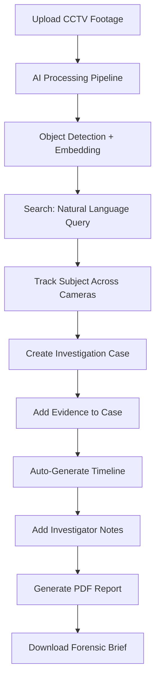
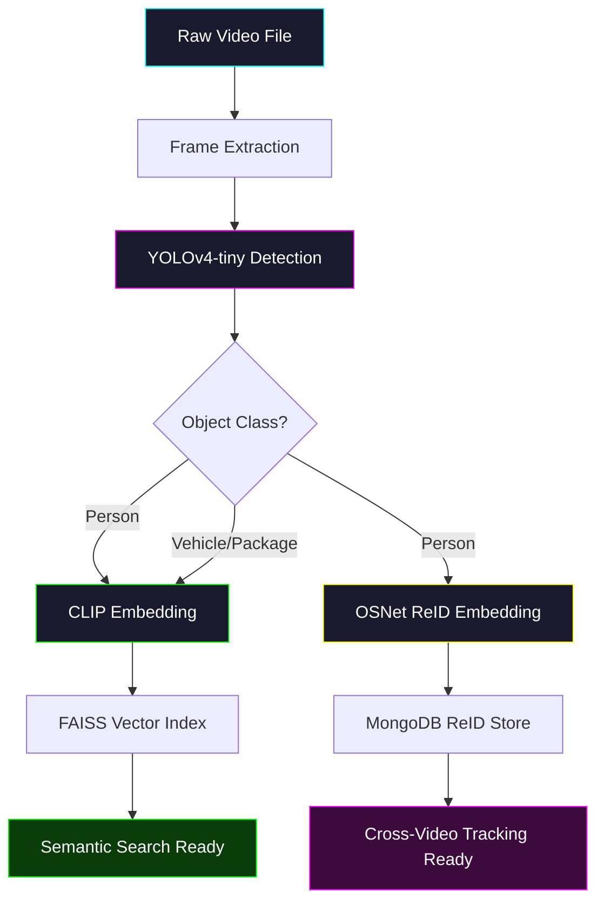
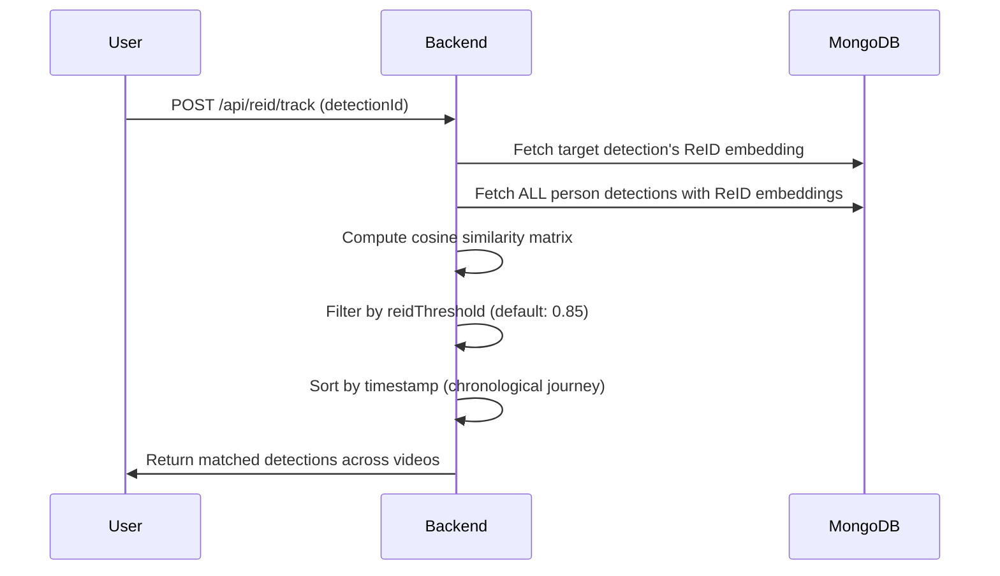
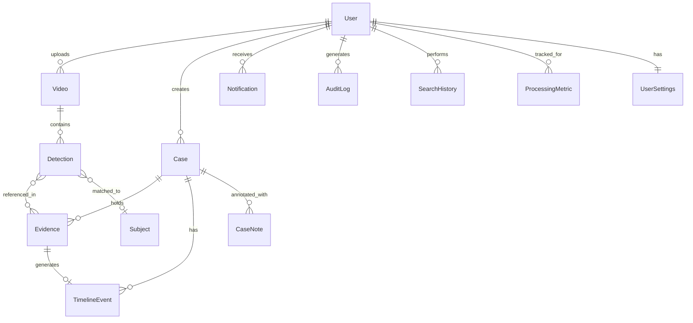

<p align="center">
  <h1 align="center">EYEQ</h1>
  <p align="center">
    <strong>AI-Powered Video Investigation & Person Re-Identification Platform</strong>
  </p>
  <p align="center">
    
    
    
    
    
    
    
    
    
  </p>
</p>

---

EYEQ is a distributed AI platform that transforms raw CCTV footage into actionable intelligence. It bridges the gap between passive video storage and active investigation — enabling natural language video search, automated object detection, cross-camera person tracking, and full-cycle case management with professional report generation.

---

## Problem

Security teams and investigators drown in hours of raw footage. Manual review is slow, error-prone, and doesn't scale. Existing tools either detect objects without context, or manage cases without AI — never both.

## Solution

EYEQ unifies the entire investigation workflow into a single platform:

1. **Upload footage** → AI automatically detects persons, vehicles, and packages
2. **Search in natural language** → "person carrying a backpack" finds matching detections via semantic vector similarity
3. **Track subjects across cameras** → Re-identification matches the same person across multiple videos using appearance embeddings
4. **Build investigation cases** → Add evidence, annotate timelines, generate professional PDF reports

---

## Architecture



---

## AI Pipeline



**Key Design Decision:** All AI thresholds (YOLO confidence, ReID similarity, search relevance) are **user-configurable** via the Settings page. The backend reads `UserSettings` from MongoDB and passes them directly to the Python inference engine — making EYEQ a tunable system, not a black box.

---

## Tech Stack

| Layer         | Technology                                                          |
|--------------|----------------------------------------------------------------------|
| **Frontend** | React 19, Vite, TanStack Router, TanStack Query, Shadcn UI, Tailwind |
| **Backend**  | Node.js, Express, Mongoose, Multer, fluent-ffmpeg, Puppeteer, JWT    |
| **AI Service** | Python, FastAPI, PyTorch, OpenCV, CLIP (ViT-B/32), OSNet, FAISS    |
| **Database** | MongoDB 6.0, FAISS (in-memory vector store)                         |
| **Queue**    | BullMQ, Redis 7                                                      |
| **Real-time**| Socket.IO                                                            |
| **Infra**    | Docker Compose, GitHub Actions CI/CD                                 |

---

## Key Features

### Video Intelligence
*(User: Add a screenshot of the Workspace showing bounding boxes and the summary panel here)*
``

- **Video Ingestion** — Multer upload, FFprobe metadata extraction (duration, FPS, resolution)
- **HTTP 206 Streaming** — Range-based video delivery for instant playback
- **AI Detection Overlay** — Real-time bounding box rendering on the video player
- **Detection Summary** — Aggregated counts for persons, vehicles, packages + peak activity window

### Semantic Search
*(User: Add a screenshot of the Search page showing natural language query and vector results here)*
``

- **Natural Language Queries** — Type "red car in parking lot" to find matching detections
- **CLIP Vector Similarity** — Text and images mapped to shared 512D vector space
- **FAISS Retrieval** — Sub-millisecond approximate nearest-neighbor search
- **Configurable Threshold** — User-adjustable relevance cutoff

### Person Re-Identification
*(User: Add a screenshot of the Subject Journey or ReID panel here)*
``

- **OSNet Embeddings** — 512D appearance signatures per person detection
- **Cross-Video Tracking** — Find the same person across multiple cameras
- **Subject Journey** — Chronological timeline of a subject's movements
- **Subject Profiles** — Persistent identity records with averaged embeddings

### Investigation Cases
*(User: Add a screenshot of the Case Details timeline or PDF report preview here)*
``

- **Case Management** — Create, prioritize, and track investigation cases
- **Evidence Collection** — Add detected objects as case evidence with one click
- **Timeline Generation** — Automatic chronological reconstruction from evidence
- **Investigator Notes** — Free-text annotations with user attribution
- **PDF Reports** — Professional forensic briefs generated via Puppeteer (headless Chrome)

### Platform Operations
*(User: Add a screenshot of the Analytics Dashboard or Administration panel here)*
``

- **JWT Authentication** — Custom auth with bcrypt password hashing
- **Role-Based Access Control** — Investigator, Supervisor, Admin roles
- **BullMQ Job Queue** — Redis-backed async video processing with concurrency control
- **Real-Time Progress** — Socket.IO broadcasting during AI pipeline execution
- **Analytics Dashboard** — Processing metrics, search history, case distribution
- **User Settings** — Configurable AI thresholds, notification preferences, retention policies
- **Notifications** — Event-driven alerts (processing complete, case updates, report ready)
- **Administration** — System-wide metrics, storage stats, audit logs
- **Audit Logging** — Tamper-evident record of all user actions

---

## Investigation Flow



---

## Quick Start

### Docker (Recommended)

```bash
git clone https://github.com/your-username/Video-Intelligence.git
cd Video-Intelligence
docker compose up --build
```

| Service        | URL                        |
|---------------|----------------------------|
| Frontend       | http://localhost:8080       |
| Backend API    | http://localhost:5000       |
| AI Service     | http://localhost:8001/docs  |

### Manual Setup

**Prerequisites:** Node.js 18+, Python 3.10+, MongoDB

```bash
# 1. AI Service
cd ai-service
python -m venv venv && venv\Scripts\activate
pip install -r requirements.txt
python -m uvicorn main:app --port 8001 --reload

# 2. Backend (new terminal)
cd backend
npm install
# Create .env with MONGODB_URI, JWT_SECRET, AI_SERVICE_URL
npm run dev

# 3. Frontend (new terminal)
cd frontend
npm install
npm run dev
```

---

## Environment Variables

### Backend (`backend/.env`)

| Variable         | Required | Default                    | Description                   |
|-----------------|----------|----------------------------|-------------------------------|
| `MONGODB_URI`   | Yes      | —                          | MongoDB connection string     |
| `JWT_SECRET`    | Yes      | —                          | JWT signing secret            |
| `AI_SERVICE_URL`| No       | `http://localhost:8001`    | Python AI service URL         |
| `REDIS_URL`     | No       | —                          | Enables BullMQ job queue      |
| `PORT`          | No       | `5000`                     | Express server port           |

### AI Service (`ai-service/.env`)

| Variable         | Required | Default                    | Description                   |
|-----------------|----------|----------------------------|-------------------------------|
| `MONGODB_URI`   | Yes      | —                          | MongoDB connection string     |
| `BACKEND_URL`   | No       | `http://backend:5000`      | Progress webhook target       |

---

## Project Structure

```
Video-Intelligence/
├── frontend/                    # React + Vite + TanStack
│   ├── src/
│   │   ├── routes/              # File-based routing (7 pages)
│   │   ├── components/          # Shadcn UI + custom components
│   │   ├── contexts/            # AuthContext (JWT state)
│   │   ├── services/            # API clients (axios)
│   │   └── hooks/               # Custom React hooks
│   └── Dockerfile
│
├── backend/                     # Node.js + Express
│   ├── src/
│   │   ├── controllers/         # 9 route handlers
│   │   ├── models/              # 13 Mongoose schemas
│   │   ├── routes/              # 9 route definitions
│   │   ├── middleware/          # Auth, RBAC, Upload
│   │   ├── services/            # ReID, Reports, Summaries
│   │   ├── queue/               # BullMQ video worker
│   │   └── server.ts            # Express entry point
│   └── Dockerfile
│
├── ai-service/                  # Python + FastAPI
│   ├── app/
│   │   ├── detectors/           # YOLOv4-tiny (OpenCV DNN)
│   │   ├── embeddings/          # CLIP encoder
│   │   ├── reid/                # OSNet person re-identification
│   │   ├── search/              # FAISS vector database
│   │   ├── services/            # Detection pipeline orchestrator
│   │   └── routes/              # FastAPI endpoints
│   ├── main.py                  # FastAPI entry point
│   └── Dockerfile
│
├── docs/                        # Architecture documentation
│   ├── Architecture.md
│   ├── AI-Pipeline.md
│   ├── DatabaseSchema.md
│   ├── SystemDesign.md
│   ├── Deployment.md
│   ├── API-Reference.md
│   └── DemoScript.md
│
├── docker-compose.yml           # Full stack orchestration
└── README.md
```

---

## Documentation

| Document | Description |
|----------|-------------|
| [Architecture](docs/Architecture.md) | System topology, inter-service communication, data flow |
| [AI Pipeline](docs/AI-Pipeline.md) | YOLO → CLIP → FAISS → OSNet → ReID pipeline details |
| [Database Schema](docs/DatabaseSchema.md) | All 13 MongoDB models with ER diagram |
| [System Design](docs/SystemDesign.md) | Architectural decisions and engineering tradeoffs |
| [Deployment](docs/Deployment.md) | Docker, manual setup, cloud deployment guide |
| [API Reference](docs/API-Reference.md) | Complete REST API documentation (40+ endpoints) |
| [Demo Script](docs/DemoScript.md) | Repeatable 3–5 minute demo walkthrough |

---

## Resume Entry

> **EYEQ — AI-Powered Investigation & Video Intelligence Platform**
>
> • Built a distributed AI platform using React, Node.js, FastAPI, MongoDB, Redis, BullMQ, and Docker.
>
> • Designed a computer vision pipeline using YOLO for object detection, CLIP embeddings for semantic video search, and ReID embeddings for cross-camera person tracking.
>
> • Implemented natural language CCTV search, vector similarity retrieval, evidence management, investigation timelines, and automated PDF report generation.
>
> • Developed cross-video subject tracking with confidence-based matching and subject journey visualization.
>
> • Engineered a production-ready architecture featuring job queues, real-time processing updates, audit logging, role-based access control, monitoring, notifications, and containerized deployment.

---

## License

Distributed under the MIT License.
# EYEQ — AI Processing Pipeline

This document details the complete computer vision and machine learning pipeline that transforms raw CCTV footage into searchable, trackable intelligence.

---

## Pipeline Overview



---

## Stage 1: Frame Extraction

**File:** `ai-service/app/services/frame_extractor.py`

| Parameter      | Value              |
|----------------|--------------------|
| Method         | OpenCV VideoCapture |
| Target FPS     | 1 frame per second  |
| Output         | BGR NumPy arrays    |

The extractor reads the video file and yields `(frame_index, timestamp_seconds, frame)` tuples at 1 FPS. This reduces a 60-second, 30fps video from 1,800 frames down to 60 frames — a 30x reduction that keeps processing fast while maintaining temporal coverage.

---

## Stage 2: Object Detection (YOLO)

**File:** `ai-service/app/detectors/yolo_detector.py`

| Parameter          | Value                                              |
|--------------------|----------------------------------------------------|
| Model              | YOLOv4-tiny                                         |
| Backend            | OpenCV DNN (no GPU required)                        |
| Input Size         | 416×416                                              |
| Confidence         | Configurable via UserSettings (default: 0.50)       |
| NMS Threshold      | 0.45                                                 |
| Target Classes     | person, car, truck, bus, motorcycle, backpack, handbag, suitcase |

**Why YOLOv4-tiny?** It runs on pure CPU via OpenCV's DNN module, eliminating the need for CUDA/GPU dependencies. This makes the project deployable on any machine — including free-tier cloud instances — without sacrificing detection quality for surveillance-relevant classes.

### Detection Output

For each detection, YOLO produces:
- `label` — Class name (e.g., "person")
- `confidence` — Float between 0–1
- `bbox` — `[x, y, width, height]` in pixel coordinates, normalized to percentages for responsive frontend overlay

---

## Stage 3: Semantic Embedding (CLIP)

**File:** `ai-service/app/embeddings/clip_encoder.py`

| Parameter          | Value                              |
|--------------------|------------------------------------|
| Model              | OpenAI CLIP ViT-B/32               |
| Output Dimension   | 512-dimensional float vector       |
| Input              | Cropped detection image (PIL)      |

Each detected object is cropped from the frame and passed through CLIP's image encoder. The resulting 512D vector captures the **semantic meaning** of the crop — not just pixel patterns, but conceptual content.

This enables natural language search: when a user types "person carrying a backpack," CLIP encodes that text to the same 512D space and finds visually similar crops via cosine similarity.

### Why CLIP over traditional classifiers?

| Approach           | Capability                                        |
|--------------------|---------------------------------------------------|
| Traditional CNN    | Classifies into fixed categories only              |
| CLIP               | Maps images and text to a **shared** vector space  |

CLIP allows **zero-shot queries** — the system can find objects it was never explicitly trained to categorize, as long as the user can describe them in natural language.

---

## Stage 4: Vector Indexing (FAISS)

**File:** `ai-service/app/search/vector_search.py`

| Parameter          | Value                              |
|--------------------|------------------------------------|
| Library            | faiss-cpu                           |
| Index Type         | IndexFlatIP (Inner Product / Cosine)|
| Dimensions         | 512                                 |
| Persistence        | In-memory per process               |

Each CLIP vector is added to the FAISS index with its detection ID as the key. When a search query arrives:

1. The query text is encoded to 512D via CLIP's text encoder
2. FAISS performs approximate nearest-neighbor search
3. Top-K results returned with similarity scores
4. Scores filtered by user-configurable `searchThreshold`
5. Detection IDs mapped back to MongoDB documents for full metadata

---

## Stage 5: Person Re-Identification (ReID)

**File:** `ai-service/app/reid/osnet.py`

| Parameter          | Value                              |
|--------------------|------------------------------------|
| Model              | OSNet (x1_0)                        |
| Weights            | Market1501 pre-trained              |
| Output Dimension   | 512-dimensional float vector       |
| Input              | Person crop resized to 256×128     |

For every detection classified as "person," an additional 512D **ReID embedding** is generated using OSNet. Unlike CLIP (which captures semantic content), OSNet is specifically trained for **person re-identification** — it learns discriminative features like clothing color, body proportions, and posture.

### Cross-Video Subject Tracking



The ReID matching pipeline:

1. User clicks "Track Subject" on a detected person
2. Backend retrieves the 512D ReID embedding for that detection
3. Backend loads all other person detections from MongoDB
4. Cosine similarity is computed between the target and every candidate
5. Matches above the user-configurable `reidThreshold` are returned
6. Results are sorted chronologically to form a **Subject Journey**

### Subject Profiles

Matched detections can be persisted as a `Subject` document, containing:
- `primaryEmbedding` — Averaged ReID vector for future lookups
- `firstSeen` / `lastSeen` — Temporal bounds
- `thumbnail` — Representative crop
- `confidenceScore` — Average match confidence

---

## Stage 6: Completion & Observability

When processing completes:

1. Video status updated to `indexed` in MongoDB
2. A `ProcessingMetric` document is created (frame count, processing time, detection count)
3. A `Notification` is conditionally dispatched based on `UserSettings.notifications.processingComplete`
4. Socket.IO broadcasts `video_progress: 100%` to the frontend
5. The video appears in the Workspace with full AI intelligence overlay

---

## Pipeline Configuration

All AI thresholds are user-configurable via the Settings page. When a video is submitted for processing, the backend reads the user's `UserSettings` document and passes the values directly to the Python AI service:

| Setting                | Default | Effect                                              |
|------------------------|---------|-----------------------------------------------------|
| `detectionThreshold`   | 0.50    | YOLO confidence cutoff — lower = more detections    |
| `reidThreshold`        | 0.85    | ReID cosine similarity cutoff — higher = stricter   |
| `searchThreshold`      | 0.70    | Semantic search relevance cutoff                     |

This makes EYEQ a **tunable** system, not a black box.
# EYEQ — API Reference

All endpoints are prefixed with `/api`. Unless noted, all routes require a valid JWT token in the `Authorization: Bearer <token>` header.

---

## Authentication

| Method | Path                | Auth | Description                    | Request Body                        | Response                           |
|--------|---------------------|------|--------------------------------|-------------------------------------|------------------------------------|
| POST   | `/api/auth/register`| No   | Create a new account           | `{ name, email, password }`         | `{ user, token }`                  |
| POST   | `/api/auth/login`   | No   | Login with credentials         | `{ email, password }`               | `{ user, token }`                  |
| GET    | `/api/auth/me`      | Yes  | Get current user profile       | —                                   | `{ _id, name, email, role }`       |

---

## Videos

| Method | Path                         | Auth | Description                        | Request Body / Params              | Response                           |
|--------|------------------------------|------|------------------------------------|------------------------------------|------------------------------------|
| POST   | `/api/videos/upload`         | Yes  | Upload a video file                | `multipart/form-data: video_file`  | Video document                     |
| GET    | `/api/videos`                | Yes  | List all user's videos             | —                                   | Video[]                            |
| GET    | `/api/videos/:id`            | Yes  | Get single video metadata          | —                                   | Video document                     |
| GET    | `/api/videos/:id/stream`     | Yes  | Stream video (HTTP 206 range)      | `?token=jwt` (query param allowed) | Binary video stream                |
| GET    | `/api/videos/:id/detections` | Yes  | Get all detections for a video     | —                                   | Detection[]                        |
| GET    | `/api/videos/:id/summary`    | Yes  | Get detection summary stats        | —                                   | `{ persons, vehicles, packages, peak_activity }` |
| GET    | `/api/videos/:id/pipeline`   | Yes  | Get processing pipeline status     | —                                   | Pipeline object                    |
| POST   | `/api/videos/:id/progress`   | No*  | AI webhook: update progress        | `{ progress, message }`            | `{ success: true }`               |

> *The progress endpoint is an internal webhook called by the Python AI service. It does not require JWT authentication.

---

## Semantic Search

| Method | Path                    | Auth | Description                           | Request Body                                      | Response                    |
|--------|-------------------------|------|---------------------------------------|---------------------------------------------------|-----------------------------|
| POST   | `/api/search`           | Yes  | Natural language video search         | `{ query, threshold?, limit? }`                   | Detection[] with scores     |
| GET    | `/api/search/metadata`  | Yes  | Get search index statistics           | —                                                  | `{ totalDetections, ... }`  |

---

## Person Re-Identification

| Method | Path                    | Auth | Description                           | Request Body                              | Response                                    |
|--------|-------------------------|------|---------------------------------------|-------------------------------------------|---------------------------------------------|
| POST   | `/api/reid/track`       | Yes  | Find same person across videos        | `{ detectionId, threshold? }`             | Match[] (sorted chronologically)            |
| POST   | `/api/reid/subjects`    | Yes  | Create a persistent subject profile   | `{ matches, sourceDetectionId }`          | Subject document                            |

---

## Cases

| Method | Path                              | Auth | Description                      | Request Body                                                    | Response              |
|--------|-----------------------------------|------|----------------------------------|-----------------------------------------------------------------|-----------------------|
| POST   | `/api/cases`                      | Yes  | Create a new case                | `{ title, description, priority }`                              | Case document         |
| GET    | `/api/cases`                      | Yes  | List user's cases                | —                                                                | Case[] with clipsCount|
| GET    | `/api/cases/:id`                  | Yes  | Get full case details            | —                                                                | `{ case, evidence, timeline, notes, summary }` |
| PUT    | `/api/cases/:id`                  | Yes  | Update case status/priority      | `{ status, priority }`                                          | Updated Case          |
| POST   | `/api/cases/:id/evidence`         | Yes  | Add evidence to a case           | `{ videoId, detectionId, timestamp, timestampSeconds, label, confidence, thumbnailPath }` | Evidence document |
| POST   | `/api/cases/:id/notes`            | Yes  | Add investigator note            | `{ content }`                                                   | CaseNote document     |
| GET    | `/api/cases/:id/report/preview`   | Yes  | Get HTML report preview          | —                                                                | `{ html }`            |
| GET    | `/api/cases/:id/report`           | Yes  | Download PDF report              | —                                                                | `application/pdf`     |

---

## Analytics

| Method | Path                        | Auth | Description                        | Response                                              |
|--------|-----------------------------|------|------------------------------------|-------------------------------------------------------|
| GET    | `/api/analytics/overview`   | Yes  | Platform statistics                | `{ totalVideos, totalDetections, totalCases }`        |
| GET    | `/api/analytics/processing` | Yes  | Processing throughput metrics      | `{ videosIndexed, framesProcessed, avgProcessingTime, recentMetrics }` |
| GET    | `/api/analytics/search`     | Yes  | Search usage analytics             | `{ totalSearches, topQueries, avgSearchTimeMs }`      |
| GET    | `/api/analytics/investigation`| Yes | Case status distribution          | `{ totalCases, casesClosed, openCases, statusDistribution }` |

---

## Settings

| Method | Path                          | Auth | Description                      | Request Body                                          | Response              |
|--------|-------------------------------|------|----------------------------------|-------------------------------------------------------|-----------------------|
| GET    | `/api/settings`               | Yes  | Get user settings                | —                                                      | UserSettings document |
| PUT    | `/api/settings`               | Yes  | Update AI/notification settings  | Partial UserSettings object                            | Updated UserSettings  |
| PUT    | `/api/settings/profile`       | Yes  | Update name/password             | `{ name?, password? }`                                 | Updated User          |
| DELETE | `/api/settings/storage/:type` | Yes  | Clear data (cascade delete)      | `:type` = `videos` or `cases`                          | `{ message }`         |

---

## Notifications

| Method | Path                      | Auth | Description                     | Response                  |
|--------|---------------------------|------|---------------------------------|---------------------------|
| GET    | `/api/notifications`      | Yes  | Get user's notifications        | Notification[]            |

---

## Administration

| Method | Path                    | Auth  | Description                        | Response                                        |
|--------|-------------------------|-------|------------------------------------|-------------------------------------------------|
| GET    | `/api/admin/metrics`    | Admin | System-wide metrics + audit log    | `{ metrics: { users, videos, cases }, activity }` |
| GET    | `/api/admin/storage`    | Admin | Disk usage statistics              | `{ uploadsSizeBytes, thumbnailsSizeBytes }`       |

> Admin endpoints require the `admin` role (enforced by RBAC middleware).

---

## AI Service (Python FastAPI)

| Method | Path        | Description                    | Request Body                                                   | Response                        |
|--------|-------------|--------------------------------|----------------------------------------------------------------|---------------------------------|
| POST   | `/process`  | Start AI processing pipeline   | `{ videoId, videoPath, detectionThreshold?, reidThreshold? }`  | `{ message, videoId }`          |
| POST   | `/search`   | Semantic vector search         | `{ query, threshold?, limit? }`                                | `{ results: [...] }`           |
| GET    | `/health`   | Health check                   | —                                                               | `{ status: "ok" }`             |
# EYEQ — System Architecture

## Overview

EYEQ is a distributed AI investigation platform built as a **three-service microarchitecture**. Each service is independently deployable, containerized via Docker, and communicates through well-defined REST APIs and event-driven channels.

```
┌─────────────────────────────────────────────────────────────────┐
│                        CLIENT BROWSER                          │
│                   React + TanStack Router                      │
└────────────────────────────┬────────────────────────────────────┘
                             │ HTTP / WebSocket
                             â–¼
┌─────────────────────────────────────────────────────────────────┐
│                     NODE.JS API GATEWAY                        │
│              Express + Mongoose + BullMQ + Socket.IO           │
│                                                                │
│  ┌──────────┐ ┌──────────┐ ┌──────────┐ ┌──────────────────┐  │
│  │   Auth   │ │  Videos  │ │  Cases   │ │  Analytics       │  │
│  │ (JWT)    │ │  (CRUD)  │ │  (CRUD)  │ │  (Aggregation)   │  │
│  └──────────┘ └──────────┘ └──────────┘ └──────────────────┘  │
│  ┌──────────┐ ┌──────────┐ ┌──────────┐ ┌──────────────────┐  │
│  │  Search  │ │   ReID   │ │  Admin   │ │  Settings        │  │
│  │ (Vector) │ │ (Track)  │ │  (RBAC)  │ │  (User Prefs)    │  │
│  └──────────┘ └──────────┘ └──────────┘ └──────────────────┘  │
└──────┬───────────────┬───────────────┬──────────────────────────┘
       │               │               │
       â–¼               â–¼               â–¼
┌────────────┐  ┌────────────┐  ┌────────────────────────────────┐
│  MongoDB   │  │   Redis    │  │     PYTHON AI SERVICE          │
│  (Data)    │  │  (Queue)   │  │  FastAPI + PyTorch + OpenCV    │
│            │  │            │  │                                │
│ 13 Models  │  │  BullMQ    │  │  ┌──────┐ ┌──────┐ ┌───────┐ │
│ Indexes    │  │  Jobs      │  │  │ YOLO │ │ CLIP │ │ OSNet │ │
│            │  │            │  │  └──────┘ └──────┘ └───────┘ │
│            │  │            │  │       │        │        │     │
│            │  │            │  │       ▼        ▼        ▼     │
│            │  │            │  │    Detect   Embed    ReID     │
│            │  │            │  │             FAISS    Match    │
└────────────┘  └────────────┘  └────────────────────────────────┘
```

---

## Service Breakdown

### 1. React Frontend

| Attribute       | Detail                                       |
|----------------|-----------------------------------------------|
| Framework      | Vite + React 19                                |
| Router         | TanStack Router (file-based)                   |
| State          | TanStack Query (server state), React Context   |
| UI Library     | Shadcn UI + Radix Primitives                   |
| Styling        | TailwindCSS + custom design tokens             |
| Real-time      | Socket.IO client (processing progress)         |

**Pages:** Landing, Workspace, Search, Cases, Analytics, Settings, Administration

### 2. Node.js Backend (API Gateway)

| Attribute       | Detail                                       |
|----------------|-----------------------------------------------|
| Framework      | Express.js                                     |
| ORM            | Mongoose (MongoDB)                             |
| Auth           | JWT (jsonwebtoken) + bcrypt                    |
| File Upload    | Multer (disk storage)                          |
| Video Metadata | fluent-ffmpeg + ffprobe                        |
| PDF Reports    | Puppeteer (headless Chrome)                    |
| Job Queue      | BullMQ (Redis-backed)                          |
| Real-time      | Socket.IO server                               |
| Middleware     | Auth, RBAC, Upload                             |

**Responsibilities:** Authentication, authorization, video management, case management, search orchestration, ReID orchestration, analytics aggregation, notification dispatch, audit logging, report generation.

### 3. Python AI Service

| Attribute       | Detail                                       |
|----------------|-----------------------------------------------|
| Framework      | FastAPI                                        |
| Detection      | YOLOv4-tiny (OpenCV DNN backend)               |
| Embeddings     | OpenAI CLIP (ViT-B/32) — 512D vectors         |
| ReID           | OSNet (Market1501 weights) — 512D signatures   |
| Vector Store   | FAISS (faiss-cpu)                               |
| Frame Extract  | OpenCV VideoCapture at 1 FPS                   |

**Responsibilities:** Frame extraction, object detection, semantic embedding generation, ReID embedding extraction, FAISS vector indexing, similarity search.

---

## Inter-Service Communication

```mermaid
sequenceDiagram
    participant Browser
    participant Backend as Node.js Backend
    participant Redis
    participant AI as Python AI Service
    participant DB as MongoDB

    Browser->>Backend: POST /api/videos/upload (multipart)
    Backend->>DB: Create Video (status: queued)
    Backend->>Browser: 201 Created
    
    alt Redis Available
        Backend->>Redis: Add BullMQ Job
        Redis->>AI: Worker picks up job
    else Direct Dispatch
        Backend->>AI: POST /process (fire-and-forget)
    end
    
    AI->>DB: Update status → processing
    AI->>AI: Extract frames → YOLO → CLIP → FAISS → ReID
    AI->>DB: Bulk insert detections
    AI->>DB: Update status → indexed
    AI->>Backend: POST /api/videos/:id/progress (webhook)
    Backend->>Browser: Socket.IO emit("video_progress")
```



---

## Data Flow: Video Upload → Indexed

1. **Upload**: Browser sends multipart form data. Multer saves to `/uploads/`.
2. **Metadata**: FFprobe extracts duration, FPS, resolution.
3. **Queue**: Video ID dispatched to BullMQ (or direct HTTP fallback).
4. **Frames**: Python extracts frames at 1 FPS using OpenCV.
5. **Detection**: YOLOv4-tiny runs on each frame. Detections filtered by user-configurable confidence threshold.
6. **Embedding**: Each detection crop is encoded to a 512D CLIP vector.
7. **ReID**: Person-class crops also get a 512D OSNet embedding.
8. **Indexing**: CLIP vectors added to FAISS index. All detection documents bulk-inserted into MongoDB.
9. **Completion**: Video status updated to `indexed`. Processing metrics recorded. Notification conditionally dispatched based on user settings.

---

## Real-Time Architecture

Socket.IO is used for live processing progress updates:

- Backend creates a **room** per video: `video_{id}`
- Frontend joins the room when viewing a video's workspace
- Python AI service sends progress webhooks to the backend
- Backend broadcasts to the room via Socket.IO

This enables the real-time progress bar and status transitions visible in the Workspace UI.
# EYEQ — Database Schema Reference

EYEQ uses MongoDB with Mongoose ODM. The database contains **13 collections** organized across four domains: Identity, Intelligence, Investigation, and Observability.

---

## Entity Relationship Diagram



---

## Identity Domain

### User

| Field          | Type       | Required | Default        | Notes                                    |
|---------------|------------|----------|----------------|------------------------------------------|
| `name`        | String     | ✅       |                | Display name                             |
| `email`       | String     | ✅       |                | Unique, login identifier                 |
| `password_hash`| String    | ✅       |                | bcrypt hashed                            |
| `role`        | Enum       |          | `investigator` | `user`, `investigator`, `supervisor`, `admin` |
| `created_at`  | Date       |          | `Date.now`     |                                          |

### UserSettings

| Field                | Type     | Required | Default   | Notes                              |
|---------------------|----------|----------|-----------|------------------------------------|
| `userId`            | ObjectId | ✅       |           | Unique, references User            |
| `detectionThreshold`| Number   |          | `0.5`     | YOLO confidence cutoff             |
| `reidThreshold`     | Number   |          | `0.85`    | ReID cosine similarity cutoff      |
| `searchThreshold`   | Number   |          | `0.7`     | Semantic search relevance cutoff   |
| `notifications`     | Object   |          |           | See sub-fields below               |
| `.processingComplete`| Boolean |          | `true`    |                                    |
| `.caseUpdates`      | Boolean  |          | `true`    |                                    |
| `.reportGenerated`  | Boolean  |          | `true`    |                                    |
| `retentionPolicy`   | Enum     |          | `forever` | `30days`, `90days`, `forever`      |
| `updatedAt`         | Date     |          | `Date.now`|                                    |

---

## Intelligence Domain

### Video

| Field            | Type       | Required | Default   | Notes                                    |
|-----------------|------------|----------|-----------|------------------------------------------|
| `filename`      | String     | ✅       |           | Multer-generated filename                |
| `originalName`  | String     | ✅       |           | User's original filename                 |
| `filepath`      | String     | ✅       |           | Absolute path on server                  |
| `size`          | Number     | ✅       |           | File size in bytes                       |
| `duration`      | Number     |          | `0`       | Seconds (FFprobe extracted)              |
| `fps`           | Number     |          | `0`       | Frames per second                        |
| `resolution`    | String     |          | `Unknown` | e.g., `1920x1080`                        |
| `status`        | Enum       |          | `queued`  | `queued`, `processing`, `indexed`, `failed` |
| `uploadedBy`    | ObjectId   | ✅       |           | References User                          |
| `pipeline`      | Object     |          |           | Processing milestone tracker             |
| `.frames_extracted` | Boolean|          | `false`   |                                          |
| `.objects_detected` | Boolean|          | `false`   |                                          |
| `.embeddings_generated` | Boolean |    | `false`   |                                          |
| `.indexed`      | Boolean    |          | `false`   |                                          |

**Indexes:** `{ uploadedBy: 1, createdAt: -1 }`

### Detection

| Field              | Type       | Required | Default   | Notes                                  |
|-------------------|------------|----------|-----------|----------------------------------------|
| `video_id`        | ObjectId   | ✅       |           | References Video                       |
| `frame`           | Number     | ✅       |           | Frame index (0-based)                  |
| `timestamp`       | String     | ✅       |           | Formatted `MM:SS` or `HH:MM:SS`       |
| `timestamp_seconds`| Number    | ✅       | `0`       | Raw seconds for sorting/seeking        |
| `label`           | String     | ✅       |           | YOLO class (person, car, etc.)         |
| `confidence`      | Number     | ✅       |           | Float 0–1                              |
| `bbox`            | Number[]   | ✅       |           | `[x%, y%, w%, h%]` percentages         |
| `reid_embedding`  | Number[]   |          |           | 512D OSNet vector (persons only)       |
| `created_at`      | Date       |          | `Date.now`|                                        |

**Indexes:** `{ video_id: 1, timestamp_seconds: 1 }`

### Subject

| Field              | Type       | Required | Notes                              |
|-------------------|------------|----------|------------------------------------|
| `primaryEmbedding`| Number[]   | ✅       | Averaged 512D ReID vector          |
| `firstSeen`       | String     | ✅       | Earliest timestamp                 |
| `lastSeen`        | String     | ✅       | Latest timestamp                   |
| `thumbnail`       | String     | ✅       | Path to representative crop        |
| `confidenceScore` | Number     | ✅       | Average match confidence           |
| `createdAt`       | Date       |          | `Date.now`                         |

---

## Investigation Domain

### Case

| Field          | Type       | Required | Default   | Notes                                        |
|---------------|------------|----------|-----------|----------------------------------------------|
| `title`       | String     | ✅       |           |                                              |
| `description` | String     |          | `""`      |                                              |
| `status`      | Enum       |          | `Open`    | `Open`, `Under Investigation`, `Review`, `Closed` |
| `priority`    | Enum       |          | `Medium`  | `Low`, `Medium`, `High`, `Critical`          |
| `uploadedBy`  | ObjectId   | ✅       |           | References User                              |

**Indexes:** `{ uploadedBy: 1, createdAt: -1 }` — Timestamps auto-generated.

### Evidence

| Field              | Type       | Required | Notes                              |
|-------------------|------------|----------|------------------------------------|
| `caseId`          | ObjectId   | ✅       | References Case                    |
| `videoId`         | String     | ✅       |                                    |
| `videoFilename`   | String     |          |                                    |
| `detectionId`     | String     | ✅       |                                    |
| `timestamp`       | String     | ✅       | Formatted timestamp                |
| `timestampSeconds`| Number     | ✅       |                                    |
| `label`           | String     | ✅       |                                    |
| `confidence`      | Number     | ✅       |                                    |
| `thumbnailPath`   | String     |          |                                    |
| `framePath`       | String     |          |                                    |
| `notes`           | String     |          |                                    |
| `originEvidenceId`| String     |          | Links to source evidence (ReID)    |

**Indexes:** `{ caseId: 1, timestampSeconds: 1 }`

### TimelineEvent

| Field              | Type       | Required | Notes                              |
|-------------------|------------|----------|------------------------------------|
| `caseId`          | ObjectId   | ✅       | References Case                    |
| `evidenceId`      | ObjectId   |          | References Evidence                |
| `timestamp`       | String     | ✅       |                                    |
| `timestampSeconds`| Number     | ✅       |                                    |
| `eventType`       | String     |          | `Detection`, `Note`, `Manual`      |
| `title`           | String     | ✅       |                                    |
| `description`     | String     |          |                                    |

**Indexes:** `{ caseId: 1, timestampSeconds: 1 }`

### CaseNote

| Field      | Type       | Required | Notes                    |
|-----------|------------|----------|--------------------------|
| `caseId`  | ObjectId   | ✅       | References Case          |
| `userId`  | ObjectId   | ✅       | References User          |
| `content` | String     | ✅       | Free-text annotation     |

---

## Observability Domain

### Notification

| Field      | Type       | Required | Default | Notes                                    |
|-----------|------------|----------|---------|------------------------------------------|
| `userId`  | ObjectId   | ✅       |         | References User                          |
| `title`   | String     | ✅       |         |                                          |
| `message` | String     | ✅       |         |                                          |
| `type`    | Enum       |          | `info`  | `info`, `success`, `warning`, `error`    |
| `read`    | Boolean    |          | `false` |                                          |

### AuditLog

| Field        | Type       | Required | Notes                          |
|-------------|------------|----------|--------------------------------|
| `userId`    | ObjectId   | ✅       | References User                |
| `action`    | String     | ✅       | e.g., `VIDEO_UPLOADED`         |
| `resourceId`| String     |          | Target entity ID               |
| `metadata`  | Mixed      |          | Arbitrary JSON payload         |
| `ipAddress` | String     |          |                                |

### ProcessingMetric

| Field              | Type       | Required | Notes                          |
|-------------------|------------|----------|--------------------------------|
| `videoId`         | ObjectId   | ✅       | References Video               |
| `userId`          | ObjectId   | ✅       | References User                |
| `processingTimeMs`| Number     | ✅       | Total pipeline duration        |
| `frameCount`      | Number     |          | Frames analyzed                |
| `detections`      | Number     |          | Objects detected               |
| `embeddings`      | Number     |          | Vectors generated              |

### SearchHistory

| Field              | Type       | Required | Notes                          |
|-------------------|------------|----------|--------------------------------|
| `userId`          | ObjectId   | ✅       | References User                |
| `query`           | String     | ✅       | Natural language query         |
| `filters`         | Mixed      |          | Confidence, date range, etc.   |
| `resultsCount`    | Number     |          | Matches returned               |
| `executionTimeMs` | Number     |          | Query latency                  |
# EYEQ — Demo Script

A repeatable 3–5 minute walkthrough that demonstrates every core capability of the EYEQ platform.

---

## Pre-Demo Setup

1. Ensure all 3 services are running (backend, frontend, AI service)
2. Have 2–3 short CCTV-style videos ready (5–15 seconds each)
3. Ideally, use clips where the **same person** appears in multiple videos

---

## Demo Flow

### 1. Authentication (30 seconds)

1. Open `http://localhost:8080`
2. Show the cinematic landing page
3. Click **Get Started** → Register with a new account
4. Point out: *"Custom JWT auth — no third-party auth providers"*

### 2. Upload & Processing (60 seconds)

1. Click **Upload Source** in the top nav
2. Upload your first video
3. Watch the real-time progress bar update via Socket.IO
4. Point out: *"BullMQ dispatches the job to a Python FastAPI worker. You're watching YOLOv4-tiny run in real-time."*
5. Upload a second video while the first is still processing
6. Point out: *"Job queue — videos are processed sequentially without race conditions"*

### 3. Workspace Intelligence (30 seconds)

1. Click on a processed video in the Workspace
2. Show the video player with detection overlays (bounding boxes)
3. Show the detection summary: persons, vehicles, packages, peak activity
4. Click on individual detections to jump to their exact timestamps
5. Point out: *"Every bounding box is a real YOLO detection stored in MongoDB"*

### 4. Semantic Search (45 seconds)

1. Navigate to **Search**
2. Type: `"person carrying a backpack"`
3. Show the results — real detection crops matched via CLIP cosine similarity
4. Point out: *"This is zero-shot search. CLIP maps text and images to the same 512D vector space. The system finds objects it was never explicitly trained on."*
5. Click on a result to navigate to its exact timestamp in the video

### 5. Cross-Camera Tracking (60 seconds)

1. From a person detection, click **Track Subject**
2. Show the Subject Journey — the same person found across multiple videos
3. Point out: *"OSNet generates a 512D identity signature per person crop. Cosine similarity matching finds the same person across cameras, even with angle changes."*
4. Click **Create Subject Profile** to persist the identity

### 6. Investigation Case (45 seconds)

1. Navigate to **Cases**
2. Click **Create Case** — give it a title like "Lobby Unauthorized Access"
3. Go back to the Workspace, select detections, and click **Add to Case**
4. Return to the Case → show the Evidence tab
5. Click the **Timeline** tab — show the auto-generated chronological reconstruction
6. Click **Notes** → add an investigator annotation
7. Point out: *"The timeline is automatically generated from evidence timestamps"*

### 7. PDF Report (30 seconds)

1. Click the **Report** tab
2. Show the HTML preview
3. Click **Download PDF**
4. Open the downloaded PDF — professional forensic brief with evidence, timeline, and notes
5. Point out: *"Puppeteer renders this server-side using headless Chromium"*

### 8. Analytics & Settings (30 seconds)

1. Navigate to **Analytics** — show real-time throughput, search history, case distribution
2. Navigate to **Settings** — drag the YOLO confidence slider, toggle a notification
3. Point out: *"These aren't UI decorations. The YOLO slider mutates a MongoDB document that the Python inference engine reads on every video upload."*

---

## Key Talking Points

Use these during the demo or Q&A:

- **"Three-service microarchitecture"** — React frontend, Node.js API gateway, Python AI service
- **"Zero-shot search"** — CLIP enables natural language queries without retraining
- **"Cross-camera tracking"** — OSNet ReID, not simple color matching
- **"Settings-driven AI"** — Thresholds are user-configurable, not hardcoded
- **"Job queue orchestration"** — BullMQ with Redis, not synchronous processing
- **"13 MongoDB collections"** — Full relational modeling in a document database
- **"Real-time observability"** — Socket.IO progress, processing metrics, audit logs
- **"Containerized deployment"** — `docker compose up` runs the entire stack

---

## Post-Demo Questions to Expect

| Question | Suggested Answer |
|----------|-----------------|
| "Does the search really work?" | Yes — CLIP encodes text and images to the same vector space. FAISS does sub-millisecond cosine similarity retrieval. |
| "How do you handle concurrent video processing?" | BullMQ job queue with concurrency: 2. Redis persists jobs across restarts. |
| "Why not use GPU?" | Deliberately chose CPU-compatible models (OpenCV DNN, CLIP ViT-B/32) so the system deploys on any machine without CUDA. |
| "How accurate is the ReID?" | OSNet trained on Market1501 achieves ~94% Rank-1 accuracy. Our cosine threshold is user-configurable (default 85%). |
| "Can this scale?" | The microservice architecture allows horizontal scaling. FAISS can be replaced with Pinecone for distributed vector search. |
# EYEQ — Deployment Guide

## Local Development (Docker Compose)

The fastest way to run the entire EYEQ platform locally.

### Prerequisites

- [Docker Desktop](https://docs.docker.com/get-docker/) installed and running
- At least 4 GB RAM available for containers

### Start

```bash
git clone https://github.com/your-username/Video-Intelligence.git
cd Video-Intelligence
docker compose up --build
```

> **Note:** The first build takes 5–10 minutes as it downloads YOLOv4-tiny weights (~24 MB), PyTorch, and headless Chromium.

### Access

| Service        | URL                          |
|---------------|------------------------------|
| Frontend       | http://localhost:8080         |
| Backend API    | http://localhost:5000         |
| AI Service     | http://localhost:8001         |
| FastAPI Docs   | http://localhost:8001/docs    |

### Stop

```bash
docker compose down
```

To also remove the MongoDB volume:

```bash
docker compose down -v
```

---

## Manual Setup (Without Docker)

For development with hot-reloading on each service.

### Prerequisites

- Node.js 18+ and npm
- Python 3.10+
- MongoDB (local or Atlas)

### 1. MongoDB

Either run a local instance:

```bash
mongod --dbpath /data/db
```

Or use [MongoDB Atlas](https://www.mongodb.com/atlas) (free tier). Copy your connection string.

### 2. AI Service

```bash
cd ai-service
python -m venv venv
venv\Scripts\activate          # Windows
# source venv/bin/activate     # macOS/Linux
pip install -r requirements.txt
python -m uvicorn main:app --host 0.0.0.0 --port 8001 --reload
```

### 3. Backend

```bash
cd backend
npm install
```

Create `backend/.env`:

```env
PORT=5000
MONGODB_URI=mongodb://localhost:27017/video-intelligence
JWT_SECRET=your-secret-key-here
AI_SERVICE_URL=http://localhost:8001
```

```bash
npm run dev
```

### 4. Frontend

```bash
cd frontend
npm install
npm run dev
```

---

## Environment Variables Reference

### Backend (`backend/.env`)

| Variable         | Required | Default                    | Description                           |
|-----------------|----------|----------------------------|---------------------------------------|
| `PORT`          | No       | `5000`                     | Express server port                   |
| `MONGODB_URI`   | Yes      |                            | MongoDB connection string             |
| `JWT_SECRET`    | Yes      |                            | Secret for JWT signing                |
| `AI_SERVICE_URL`| No       | `http://localhost:8001`    | Python AI service base URL            |
| `REDIS_URL`     | No       |                            | Redis connection string (enables BullMQ) |
| `REDIS_HOST`    | No       | `127.0.0.1`               | Redis host (alternative to URL)       |
| `REDIS_PORT`    | No       | `6379`                     | Redis port                            |

### AI Service (`ai-service/.env`)

| Variable         | Required | Default                    | Description                           |
|-----------------|----------|----------------------------|---------------------------------------|
| `MONGODB_URI`   | Yes      |                            | MongoDB connection string             |
| `BACKEND_URL`   | No       | `http://backend:5000`      | Backend URL for progress webhooks     |
| `AI_SERVICE_PORT`| No      | `8001`                     | FastAPI server port                   |

### Frontend

| Variable         | Required | Default                    | Description                           |
|-----------------|----------|----------------------------|---------------------------------------|
| `VITE_API_URL`  | No       | `http://localhost:5000`    | Backend API base URL                  |

---

## Health Check Endpoints

| Service    | Endpoint                | Expected Response              |
|-----------|-------------------------|--------------------------------|
| Backend    | `GET /api/auth/me`      | 401 (confirms server is up)    |
| AI Service | `GET /health`           | `{"status": "ok"}`             |

---

## Cloud Deployment Recommendations

### Frontend → Vercel

1. Connect GitHub repo to Vercel
2. Set root directory to `frontend`
3. Set build command: `npm run build`
4. Set output directory: `.output/public` (TanStack Start SSR)
5. Set environment variable: `VITE_API_URL=https://your-backend.render.com`

### Backend → Render

1. Create a new Web Service from the GitHub repo
2. Set root directory to `backend`
3. Set build command: `npm install && npm run build`
4. Set start command: `npm start`
5. Configure environment variables (see table above)

### AI Service → Railway

1. Create a new service from the GitHub repo
2. Set root directory to `ai-service`
3. Use the existing `Dockerfile`
4. Configure environment variables

### MongoDB → MongoDB Atlas

Use the free M0 cluster tier. Whitelist your backend's IP address.

### Redis → Upstash

Use the free tier for BullMQ job queuing. Copy the Redis connection URL into `REDIS_URL`.

---

## Docker Compose Configuration

The `docker-compose.yml` at the project root defines 5 services:

| Service      | Image/Build         | Ports     | Volumes                        |
|-------------|---------------------|-----------|--------------------------------|
| `redis`     | `redis:7-alpine`    | 6379      |                                |
| `mongodb`   | `mongo:6.0`         | 27017     | `mongodb_data` (persistent)    |
| `ai-service`| Build `./ai-service` | 8001     | `static/`, `uploads/` (shared) |
| `backend`   | Build `./backend`    | 5000     | `uploads/` (shared)            |
| `frontend`  | Build `./frontend`   | 8080     |                                |

The `uploads/` directory is shared between backend and AI service so the Python process can read video files written by Multer.
# EYEQ — System Design Decisions

This document explains the architectural tradeoffs, design rationale, and engineering decisions behind EYEQ.

---

## Why Microservices?

EYEQ splits into three services rather than a monolith because the workloads have fundamentally different resource profiles:

| Service        | Workload Type | CPU Profile        | Memory Profile      |
|---------------|---------------|--------------------|---------------------|
| Frontend       | I/O bound     | Minimal (static)   | Minimal              |
| Backend        | I/O bound     | Low (API routing)  | Moderate (Mongoose)  |
| AI Service     | CPU bound     | Very High (PyTorch)| High (model weights) |

Running YOLO inference inside the Node.js process would block the event loop and make the API unresponsive during video processing. The microservice split allows:

- **Independent scaling**: Deploy more AI workers without touching the API
- **Language optimization**: Python for ML (ecosystem), Node.js for I/O (async)
- **Fault isolation**: If PyTorch crashes, the API and frontend remain available

---

## Why BullMQ Over Direct HTTP?

**Problem:** When a user uploads a video, the AI pipeline takes 30–120 seconds. We cannot block the HTTP response.

**Considered Approaches:**

| Approach           | Pros                    | Cons                              |
|--------------------|-------------------------|-----------------------------------|
| Direct HTTP        | Simple                  | No retry, no queue visibility     |
| BullMQ + Redis     | Retry, ordering, observability | Requires Redis                |
| RabbitMQ           | Enterprise-grade        | Overkill, complex setup          |
| AWS SQS            | Managed                 | Cloud lock-in, cost              |

**Decision:** BullMQ with Redis. It provides:
- **Job persistence** — survives service restarts
- **Concurrency control** — process 2 videos at a time
- **Event hooks** — `completed` and `failed` handlers for observability
- **Graceful fallback** — when Redis is unavailable (local dev), the system falls back to direct HTTP dispatch

---

## Why FAISS Over Pinecone/Weaviate?

| Option         | Hosting     | Latency | Cost   | Complexity |
|---------------|-------------|---------|--------|------------|
| Pinecone       | Cloud       | ~50ms   | Paid   | Medium     |
| Weaviate       | Self-hosted | ~20ms   | Free   | High       |
| FAISS (in-mem) | In-process  | <1ms    | Free   | Low        |

**Decision:** FAISS in-memory. For a single-instance deployment with <100K vectors, FAISS delivers sub-millisecond search latency with zero infrastructure overhead. If EYEQ needed to scale to millions of vectors across distributed nodes, we would migrate to a dedicated vector database.

---

## Why JWT Over Sessions?

| Approach       | Stateless? | Scalable? | Frontend Complexity |
|---------------|------------|-----------|---------------------|
| Session cookies| No         | Needs Redis store | Low          |
| JWT            | Yes        | Yes       | Medium              |

**Decision:** JWT with `localStorage`. The token contains `userId` and `role`, enabling stateless authentication across all API routes. No server-side session store required.

**Security measures:**
- bcrypt password hashing (salt rounds: 10)
- Token expiration (configurable)
- Query parameter fallback for video streaming (allows authenticated `<video>` src URLs)

---

## Multi-Tenant Data Isolation

Even though EYEQ is primarily a single-user portfolio project, the data model is designed for multi-tenant isolation:

```
Every query filters by userId
    ↓
User A cannot see User B's:
    Videos
    Cases
    Evidence
    Search History
    Processing Metrics
    Notifications
    Settings
```

This is enforced at the **controller level**, not the database level. Every controller extracts `userId` from the JWT token and uses it as a query filter.

**Why not database-level isolation?** Multi-database or multi-collection tenancy would add complexity without benefit at this scale. The per-query filter approach is the standard pattern for SaaS applications with <10,000 tenants.

---

## Settings-Driven AI Pipeline

A critical design decision: **AI thresholds are not hardcoded.** They flow from the database to the inference engine:

```
UserSettings (MongoDB)
    ↓ read on video upload
Backend Queue Worker
    ↓ pass as request payload
FastAPI /process endpoint
    ↓ inject into pipeline
YOLOv4-tiny conf_threshold
CLIP search similarity cutoff
OSNet ReID cosine threshold
```

This means a supervisor could set stricter thresholds for production investigations while a trainee uses relaxed thresholds for learning — all from the same deployment.

---

## Report Generation Architecture

**Problem:** Generate professional PDF investigation reports from dynamic case data.

**Considered Approaches:**

| Approach           | Quality | Dynamic Content | Complexity |
|--------------------|---------|-----------------|------------|
| pdfkit (raw)       | Low     | Hard            | High       |
| jsPDF (client)     | Medium  | Medium          | Medium     |
| Puppeteer (Chrome) | High    | Easy (HTML/CSS) | Medium     |

**Decision:** Puppeteer with HTML templating. We generate a full HTML document with styled tables, headers, and evidence thumbnails, then use headless Chromium to convert it to PDF. This gives us pixel-perfect control over the output while allowing standard CSS for styling.

---

## Real-Time Progress Updates

**Problem:** Video processing takes 30–120 seconds. Users need live feedback.

**Architecture:**

1. Python AI service sends HTTP webhook to `POST /api/videos/:id/progress`
2. Backend receives webhook and broadcasts via Socket.IO to room `video_{id}`
3. Frontend subscribes to the room and updates the progress bar

**Why not direct WebSocket from Python to Browser?** The Node.js backend serves as a centralized message broker, avoiding a direct dependency between the browser and the AI service. This maintains clean service boundaries.

---

## Notification System Design

Notifications are **event-driven** and **settings-aware**:

```
Event occurs (video processed, evidence added, report generated)
    ↓
Check UserSettings.notifications[eventType]
    ↓
If enabled → Create Notification document
If disabled → Skip silently
```

This gives users genuine control over their alert volume, which is a production-grade feature most student projects omit entirely.

---

## Cascade Deletion Strategy

When a user clears their storage via Settings, the system performs a proper cascade:

**Clear Videos:**
```
Find user's videos → Get video IDs
    → Delete Detections (by video_id)
    → Delete Videos
```

**Clear Cases:**
```
Find user's cases → Get case IDs
    → Delete Evidence (by caseId)
    → Delete TimelineEvents (by caseId)
    → Delete CaseNotes (by caseId)
    → Delete Cases
```

This ensures zero orphaned documents remain in the database after a destructive operation.
