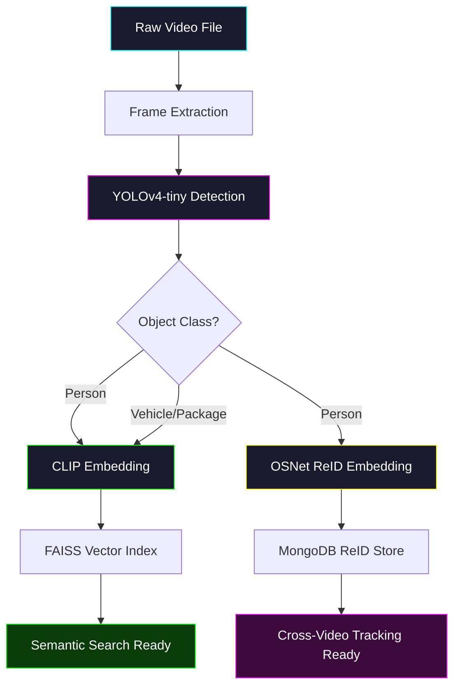
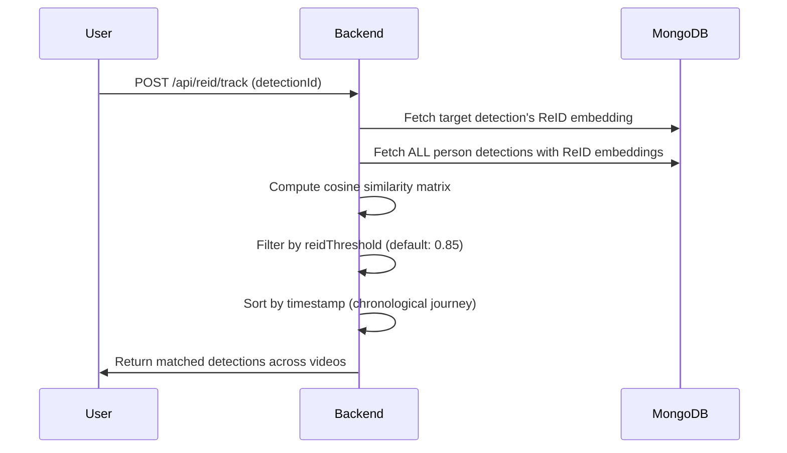

# EYEQ — AI Processing Pipeline

This document details the complete computer vision and machine learning pipeline that transforms raw CCTV footage into searchable, trackable intelligence.

---

## Pipeline Overview

---

## Stage 1: Frame Extraction

**File:** `ai-service/app/services/frame_extractor.py`

| Parameter      | Value              |
|----------------|--------------------|
| Method         | OpenCV VideoCapture |
| Target FPS     | 1 frame per second  |
| Output         | BGR NumPy arrays    |

The extractor reads the video file and yields `(frame_index, timestamp_seconds, frame)` tuples at 1 FPS. This reduces a 60-second, 30fps video from 1,800 frames down to 60 frames — a 30x reduction that keeps processing fast while maintaining temporal coverage.

---

## Stage 2: Object Detection (YOLO)

**File:** `ai-service/app/detectors/yolo_detector.py`

| Parameter          | Value                                              |
|--------------------|----------------------------------------------------|
| Model              | YOLOv4-tiny                                         |
| Backend            | OpenCV DNN (no GPU required)                        |
| Input Size         | 416×416                                              |
| Confidence         | Configurable via UserSettings (default: 0.50)       |
| NMS Threshold      | 0.45                                                 |
| Target Classes     | person, car, truck, bus, motorcycle, backpack, handbag, suitcase |

**Why YOLOv4-tiny?** It runs on pure CPU via OpenCV's DNN module, eliminating the need for CUDA/GPU dependencies. This makes the project deployable on any machine — including free-tier cloud instances — without sacrificing detection quality for surveillance-relevant classes.

### Detection Output

For each detection, YOLO produces:
- `label` — Class name (e.g., "person")
- `confidence` — Float between 0–1
- `bbox` — `[x, y, width, height]` in pixel coordinates, normalized to percentages for responsive frontend overlay

---

## Stage 3: Semantic Embedding (CLIP)

**File:** `ai-service/app/embeddings/clip_encoder.py`

| Parameter          | Value                              |
|--------------------|------------------------------------|
| Model              | OpenAI CLIP ViT-B/32               |
| Output Dimension   | 512-dimensional float vector       |
| Input              | Cropped detection image (PIL)      |

Each detected object is cropped from the frame and passed through CLIP's image encoder. The resulting 512D vector captures the **semantic meaning** of the crop — not just pixel patterns, but conceptual content.

This enables natural language search: when a user types "person carrying a backpack," CLIP encodes that text to the same 512D space and finds visually similar crops via cosine similarity.

### Why CLIP over traditional classifiers?

| Approach           | Capability                                        |
|--------------------|---------------------------------------------------|
| Traditional CNN    | Classifies into fixed categories only              |
| CLIP               | Maps images and text to a **shared** vector space  |

CLIP allows **zero-shot queries** — the system can find objects it was never explicitly trained to categorize, as long as the user can describe them in natural language.

---

## Stage 4: Vector Indexing (FAISS)

**File:** `ai-service/app/search/vector_search.py`

| Parameter          | Value                              |
|--------------------|------------------------------------|
| Library            | faiss-cpu                           |
| Index Type         | IndexFlatIP (Inner Product / Cosine)|
| Dimensions         | 512                                 |
| Persistence        | In-memory per process               |

Each CLIP vector is added to the FAISS index with its detection ID as the key. When a search query arrives:

1. The query text is encoded to 512D via CLIP's text encoder
2. FAISS performs approximate nearest-neighbor search
3. Top-K results returned with similarity scores
4. Scores filtered by user-configurable `searchThreshold`
5. Detection IDs mapped back to MongoDB documents for full metadata

---

## Stage 5: Person Re-Identification (ReID)

**File:** `ai-service/app/reid/osnet.py`

| Parameter          | Value                              |
|--------------------|------------------------------------|
| Model              | OSNet (x1_0)                        |
| Weights            | Market1501 pre-trained              |
| Output Dimension   | 512-dimensional float vector       |
| Input              | Person crop resized to 256×128     |

For every detection classified as "person," an additional 512D **ReID embedding** is generated using OSNet. Unlike CLIP (which captures semantic content), OSNet is specifically trained for **person re-identification** — it learns discriminative features like clothing color, body proportions, and posture.

### Cross-Video Subject Tracking

The ReID matching pipeline:

1. User clicks "Track Subject" on a detected person
2. Backend retrieves the 512D ReID embedding for that detection
3. Backend loads all other person detections from MongoDB
4. Cosine similarity is computed between the target and every candidate
5. Matches above the user-configurable `reidThreshold` are returned
6. Results are sorted chronologically to form a **Subject Journey**

### Subject Profiles

Matched detections can be persisted as a `Subject` document, containing:
- `primaryEmbedding` — Averaged ReID vector for future lookups
- `firstSeen` / `lastSeen` — Temporal bounds
- `thumbnail` — Representative crop
- `confidenceScore` — Average match confidence

---

## Stage 6: Completion & Observability

When processing completes:

1. Video status updated to `indexed` in MongoDB
2. A `ProcessingMetric` document is created (frame count, processing time, detection count)
3. A `Notification` is conditionally dispatched based on `UserSettings.notifications.processingComplete`
4. Socket.IO broadcasts `video_progress: 100%` to the frontend
5. The video appears in the Workspace with full AI intelligence overlay

---

## Pipeline Configuration

All AI thresholds are user-configurable via the Settings page. When a video is submitted for processing, the backend reads the user's `UserSettings` document and passes the values directly to the Python AI service:

| Setting                | Default | Effect                                              |
|------------------------|---------|-----------------------------------------------------|
| `detectionThreshold`   | 0.50    | YOLO confidence cutoff — lower = more detections    |
| `reidThreshold`        | 0.85    | ReID cosine similarity cutoff — higher = stricter   |
| `searchThreshold`      | 0.70    | Semantic search relevance cutoff                     |

This makes EYEQ a **tunable** system, not a black box.
