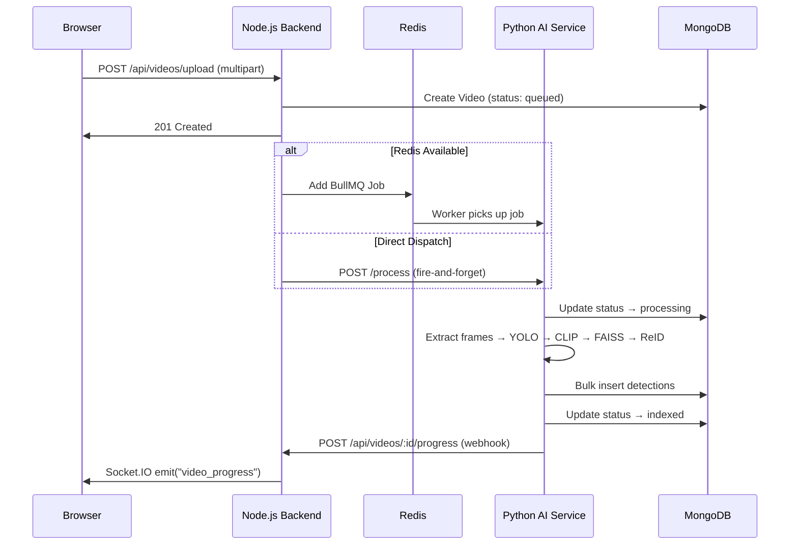

# EYEQ — System Architecture

## Overview

EYEQ is a distributed AI investigation platform built as a **three-service microarchitecture**. Each service is independently deployable, containerized via Docker, and communicates through well-defined REST APIs and event-driven channels.

```
┌─────────────────────────────────────────────────────────────────┐
│                        CLIENT BROWSER                          │
│                   React + TanStack Router                      │
└────────────────────────────┬────────────────────────────────────┘
                             │ HTTP / WebSocket
                             ▼
┌─────────────────────────────────────────────────────────────────┐
│                     NODE.JS API GATEWAY                        │
│              Express + Mongoose + BullMQ + Socket.IO           │
│                                                                │
│  ┌──────────┐ ┌──────────┐ ┌──────────┐ ┌──────────────────┐  │
│  │   Auth   │ │  Videos  │ │  Cases   │ │  Analytics       │  │
│  │ (JWT)    │ │  (CRUD)  │ │  (CRUD)  │ │  (Aggregation)   │  │
│  └──────────┘ └──────────┘ └──────────┘ └──────────────────┘  │
│  ┌──────────┐ ┌──────────┐ ┌──────────┐ ┌──────────────────┐  │
│  │  Search  │ │   ReID   │ │  Admin   │ │  Settings        │  │
│  │ (Vector) │ │ (Track)  │ │  (RBAC)  │ │  (User Prefs)    │  │
│  └──────────┘ └──────────┘ └──────────┘ └──────────────────┘  │
└──────┬───────────────┬───────────────┬──────────────────────────┘
       │               │               │
       ▼               ▼               ▼
┌────────────┐  ┌────────────┐  ┌────────────────────────────────┐
│  MongoDB   │  │   Redis    │  │     PYTHON AI SERVICE          │
│  (Data)    │  │  (Queue)   │  │  FastAPI + PyTorch + OpenCV    │
│            │  │            │  │                                │
│ 13 Models  │  │  BullMQ    │  │  ┌──────┐ ┌──────┐ ┌───────┐ │
│ Indexes    │  │  Jobs      │  │  │ YOLO │ │ CLIP │ │ OSNet │ │
│            │  │            │  │  └──────┘ └──────┘ └───────┘ │
│            │  │            │  │       │        │        │     │
│            │  │            │  │       ▼        ▼        ▼     │
│            │  │            │  │    Detect   Embed    ReID     │
│            │  │            │  │             FAISS    Match    │
└────────────┘  └────────────┘  └────────────────────────────────┘
```

---

## Service Breakdown

### 1. React Frontend

| Attribute       | Detail                                       |
|----------------|-----------------------------------------------|
| Framework      | Vite + React 19                                |
| Router         | TanStack Router (file-based)                   |
| State          | TanStack Query (server state), React Context   |
| UI Library     | Shadcn UI + Radix Primitives                   |
| Styling        | TailwindCSS + custom design tokens             |
| Real-time      | Socket.IO client (processing progress)         |

**Pages:** Landing, Workspace, Search, Cases, Analytics, Settings, Administration

### 2. Node.js Backend (API Gateway)

| Attribute       | Detail                                       |
|----------------|-----------------------------------------------|
| Framework      | Express.js                                     |
| ORM            | Mongoose (MongoDB)                             |
| Auth           | JWT (jsonwebtoken) + bcrypt                    |
| File Upload    | Multer (disk storage)                          |
| Video Metadata | fluent-ffmpeg + ffprobe                        |
| PDF Reports    | Puppeteer (headless Chrome)                    |
| Job Queue      | BullMQ (Redis-backed)                          |
| Real-time      | Socket.IO server                               |
| Middleware     | Auth, RBAC, Upload                             |

**Responsibilities:** Authentication, authorization, video management, case management, search orchestration, ReID orchestration, analytics aggregation, notification dispatch, audit logging, report generation.

### 3. Python AI Service

| Attribute       | Detail                                       |
|----------------|-----------------------------------------------|
| Framework      | FastAPI                                        |
| Detection      | YOLOv4-tiny (OpenCV DNN backend)               |
| Embeddings     | OpenAI CLIP (ViT-B/32) — 512D vectors         |
| ReID           | OSNet (Market1501 weights) — 512D signatures   |
| Vector Store   | FAISS (faiss-cpu)                               |
| Frame Extract  | OpenCV VideoCapture at 1 FPS                   |

**Responsibilities:** Frame extraction, object detection, semantic embedding generation, ReID embedding extraction, FAISS vector indexing, similarity search.

---

## Inter-Service Communication



---

## Data Flow: Video Upload → Indexed

1. **Upload**: Browser sends multipart form data. Multer saves to `/uploads/`.
2. **Metadata**: FFprobe extracts duration, FPS, resolution.
3. **Queue**: Video ID dispatched to BullMQ (or direct HTTP fallback).
4. **Frames**: Python extracts frames at 1 FPS using OpenCV.
5. **Detection**: YOLOv4-tiny runs on each frame. Detections filtered by user-configurable confidence threshold.
6. **Embedding**: Each detection crop is encoded to a 512D CLIP vector.
7. **ReID**: Person-class crops also get a 512D OSNet embedding.
8. **Indexing**: CLIP vectors added to FAISS index. All detection documents bulk-inserted into MongoDB.
9. **Completion**: Video status updated to `indexed`. Processing metrics recorded. Notification conditionally dispatched based on user settings.

---

## Real-Time Architecture

Socket.IO is used for live processing progress updates:

- Backend creates a **room** per video: `video_{id}`
- Frontend joins the room when viewing a video's workspace
- Python AI service sends progress webhooks to the backend
- Backend broadcasts to the room via Socket.IO

This enables the real-time progress bar and status transitions visible in the Workspace UI.
