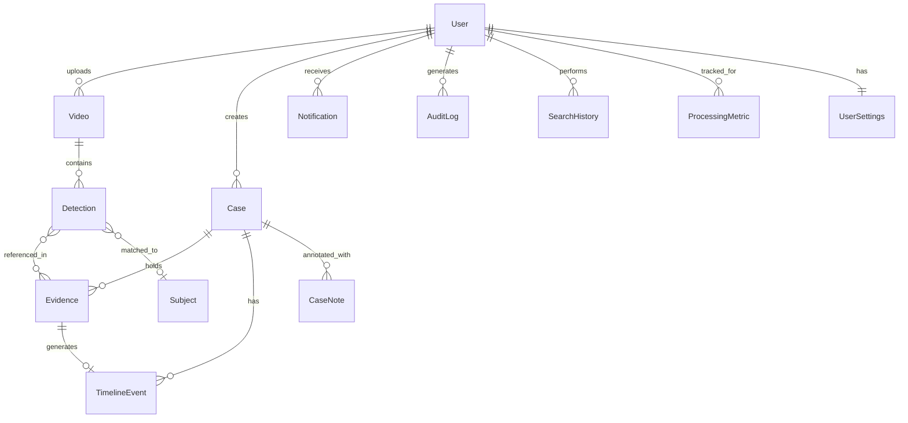

# EYEQ — Database Schema Reference

EYEQ uses MongoDB with Mongoose ODM. The database contains **13 collections** organized across four domains: Identity, Intelligence, Investigation, and Observability.

---

## Entity Relationship Diagram

---

## Identity Domain

### User

| Field          | Type       | Required | Default        | Notes                                    |
|---------------|------------|----------|----------------|------------------------------------------|
| `name`        | String     | ✅       |                | Display name                             |
| `email`       | String     | ✅       |                | Unique, login identifier                 |
| `password_hash`| String    | ✅       |                | bcrypt hashed                            |
| `role`        | Enum       |          | `investigator` | `user`, `investigator`, `supervisor`, `admin` |
| `created_at`  | Date       |          | `Date.now`     |                                          |

### UserSettings

| Field                | Type     | Required | Default   | Notes                              |
|---------------------|----------|----------|-----------|------------------------------------|
| `userId`            | ObjectId | ✅       |           | Unique, references User            |
| `detectionThreshold`| Number   |          | `0.5`     | YOLO confidence cutoff             |
| `reidThreshold`     | Number   |          | `0.85`    | ReID cosine similarity cutoff      |
| `searchThreshold`   | Number   |          | `0.7`     | Semantic search relevance cutoff   |
| `notifications`     | Object   |          |           | See sub-fields below               |
| `.processingComplete`| Boolean |          | `true`    |                                    |
| `.caseUpdates`      | Boolean  |          | `true`    |                                    |
| `.reportGenerated`  | Boolean  |          | `true`    |                                    |
| `retentionPolicy`   | Enum     |          | `forever` | `30days`, `90days`, `forever`      |
| `updatedAt`         | Date     |          | `Date.now`|                                    |

---

## Intelligence Domain

### Video

| Field            | Type       | Required | Default   | Notes                                    |
|-----------------|------------|----------|-----------|------------------------------------------|
| `filename`      | String     | ✅       |           | Multer-generated filename                |
| `originalName`  | String     | ✅       |           | User's original filename                 |
| `filepath`      | String     | ✅       |           | Absolute path on server                  |
| `size`          | Number     | ✅       |           | File size in bytes                       |
| `duration`      | Number     |          | `0`       | Seconds (FFprobe extracted)              |
| `fps`           | Number     |          | `0`       | Frames per second                        |
| `resolution`    | String     |          | `Unknown` | e.g., `1920x1080`                        |
| `status`        | Enum       |          | `queued`  | `queued`, `processing`, `indexed`, `failed` |
| `uploadedBy`    | ObjectId   | ✅       |           | References User                          |
| `pipeline`      | Object     |          |           | Processing milestone tracker             |
| `.frames_extracted` | Boolean|          | `false`   |                                          |
| `.objects_detected` | Boolean|          | `false`   |                                          |
| `.embeddings_generated` | Boolean |    | `false`   |                                          |
| `.indexed`      | Boolean    |          | `false`   |                                          |

**Indexes:** `{ uploadedBy: 1, createdAt: -1 }`

### Detection

| Field              | Type       | Required | Default   | Notes                                  |
|-------------------|------------|----------|-----------|----------------------------------------|
| `video_id`        | ObjectId   | ✅       |           | References Video                       |
| `frame`           | Number     | ✅       |           | Frame index (0-based)                  |
| `timestamp`       | String     | ✅       |           | Formatted `MM:SS` or `HH:MM:SS`       |
| `timestamp_seconds`| Number    | ✅       | `0`       | Raw seconds for sorting/seeking        |
| `label`           | String     | ✅       |           | YOLO class (person, car, etc.)         |
| `confidence`      | Number     | ✅       |           | Float 0–1                              |
| `bbox`            | Number[]   | ✅       |           | `[x%, y%, w%, h%]` percentages         |
| `reid_embedding`  | Number[]   |          |           | 512D OSNet vector (persons only)       |
| `created_at`      | Date       |          | `Date.now`|                                        |

**Indexes:** `{ video_id: 1, timestamp_seconds: 1 }`

### Subject

| Field              | Type       | Required | Notes                              |
|-------------------|------------|----------|------------------------------------|
| `primaryEmbedding`| Number[]   | ✅       | Averaged 512D ReID vector          |
| `firstSeen`       | String     | ✅       | Earliest timestamp                 |
| `lastSeen`        | String     | ✅       | Latest timestamp                   |
| `thumbnail`       | String     | ✅       | Path to representative crop        |
| `confidenceScore` | Number     | ✅       | Average match confidence           |
| `createdAt`       | Date       |          | `Date.now`                         |

---

## Investigation Domain

### Case

| Field          | Type       | Required | Default   | Notes                                        |
|---------------|------------|----------|-----------|----------------------------------------------|
| `title`       | String     | ✅       |           |                                              |
| `description` | String     |          | `""`      |                                              |
| `status`      | Enum       |          | `Open`    | `Open`, `Under Investigation`, `Review`, `Closed` |
| `priority`    | Enum       |          | `Medium`  | `Low`, `Medium`, `High`, `Critical`          |
| `uploadedBy`  | ObjectId   | ✅       |           | References User                              |

**Indexes:** `{ uploadedBy: 1, createdAt: -1 }` — Timestamps auto-generated.

### Evidence

| Field              | Type       | Required | Notes                              |
|-------------------|------------|----------|------------------------------------|
| `caseId`          | ObjectId   | ✅       | References Case                    |
| `videoId`         | String     | ✅       |                                    |
| `videoFilename`   | String     |          |                                    |
| `detectionId`     | String     | ✅       |                                    |
| `timestamp`       | String     | ✅       | Formatted timestamp                |
| `timestampSeconds`| Number     | ✅       |                                    |
| `label`           | String     | ✅       |                                    |
| `confidence`      | Number     | ✅       |                                    |
| `thumbnailPath`   | String     |          |                                    |
| `framePath`       | String     |          |                                    |
| `notes`           | String     |          |                                    |
| `originEvidenceId`| String     |          | Links to source evidence (ReID)    |

**Indexes:** `{ caseId: 1, timestampSeconds: 1 }`

### TimelineEvent

| Field              | Type       | Required | Notes                              |
|-------------------|------------|----------|------------------------------------|
| `caseId`          | ObjectId   | ✅       | References Case                    |
| `evidenceId`      | ObjectId   |          | References Evidence                |
| `timestamp`       | String     | ✅       |                                    |
| `timestampSeconds`| Number     | ✅       |                                    |
| `eventType`       | String     |          | `Detection`, `Note`, `Manual`      |
| `title`           | String     | ✅       |                                    |
| `description`     | String     |          |                                    |

**Indexes:** `{ caseId: 1, timestampSeconds: 1 }`

### CaseNote

| Field      | Type       | Required | Notes                    |
|-----------|------------|----------|--------------------------|
| `caseId`  | ObjectId   | ✅       | References Case          |
| `userId`  | ObjectId   | ✅       | References User          |
| `content` | String     | ✅       | Free-text annotation     |

---

## Observability Domain

### Notification

| Field      | Type       | Required | Default | Notes                                    |
|-----------|------------|----------|---------|------------------------------------------|
| `userId`  | ObjectId   | ✅       |         | References User                          |
| `title`   | String     | ✅       |         |                                          |
| `message` | String     | ✅       |         |                                          |
| `type`    | Enum       |          | `info`  | `info`, `success`, `warning`, `error`    |
| `read`    | Boolean    |          | `false` |                                          |

### AuditLog

| Field        | Type       | Required | Notes                          |
|-------------|------------|----------|--------------------------------|
| `userId`    | ObjectId   | ✅       | References User                |
| `action`    | String     | ✅       | e.g., `VIDEO_UPLOADED`         |
| `resourceId`| String     |          | Target entity ID               |
| `metadata`  | Mixed      |          | Arbitrary JSON payload         |
| `ipAddress` | String     |          |                                |

### ProcessingMetric

| Field              | Type       | Required | Notes                          |
|-------------------|------------|----------|--------------------------------|
| `videoId`         | ObjectId   | ✅       | References Video               |
| `userId`          | ObjectId   | ✅       | References User                |
| `processingTimeMs`| Number     | ✅       | Total pipeline duration        |
| `frameCount`      | Number     |          | Frames analyzed                |
| `detections`      | Number     |          | Objects detected               |
| `embeddings`      | Number     |          | Vectors generated              |

### SearchHistory

| Field              | Type       | Required | Notes                          |
|-------------------|------------|----------|--------------------------------|
| `userId`          | ObjectId   | ✅       | References User                |
| `query`           | String     | ✅       | Natural language query         |
| `filters`         | Mixed      |          | Confidence, date range, etc.   |
| `resultsCount`    | Number     |          | Matches returned               |
| `executionTimeMs` | Number     |          | Query latency                  |
